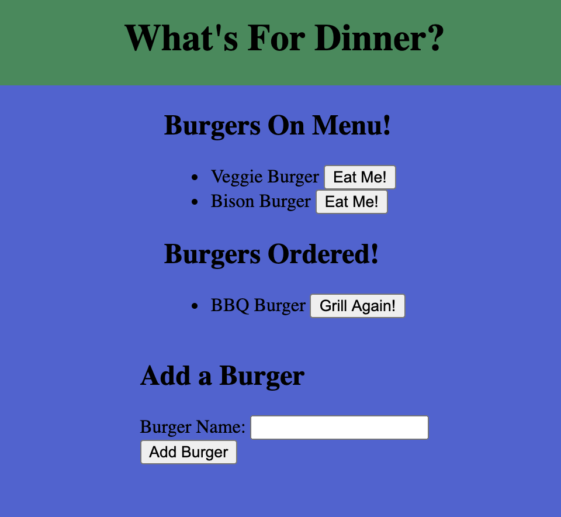

# Node Express Handlebars - Burger Project

Table of Contents: |
------------- |
[Description](#description)|
[Installation](#installation)|
[Usage](#usage)|
[License](#license)|
[Contribution](#contribution)|
[Tests](#tests)|
[Questions](#questions)|

# Description
In this project, we are using node, mysql, express, express-handlebars to create a working CRUD burger menu.

# Installation
npm install express, express-handlebars, mysql

# Usage
This project would be fantastic for any company with incoming and outgoing employees or products, especially inventory.

# License
None

# Contribution
TeamWork

# Tests
None

# Questions
GitHub: Wolfdog27
If you have any additional questions please reach me at (https://github.com/Wolfdog27/) or e-mail me at KyleNicholasAnderson@gmail.com

